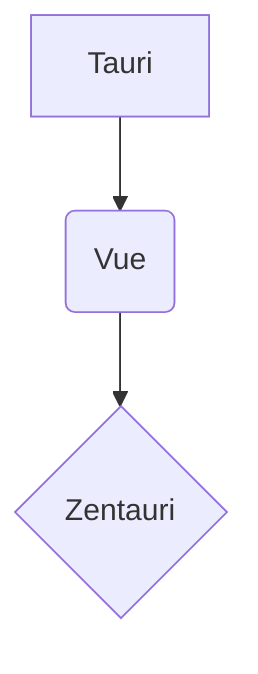

# Welcome to Zentauri

This is a minimal Markdown editor based on Tauri and Vue.
specially designed for the presentation of text in systematic grammar works

Klick the third icon from the top in the left sideline to get a (partially clickable) cheatsheet describing the implemented
Markdown extensions

## Scholarly Editing (e.g. Sanskrit Grammar)
::: important[Check it out]
Try the extensive Markdown extensions ported from ZenNotes!
:::

## Formulae

You can also write math formulae using KaTeX Syntax:
$e^{i\pi} + 1 = 0$
or
$
\hat{H}\psi(x, y, z) = \left[ -\frac{\hbar^2}{2m} \left( \frac{\partial^2}{\partial x^2} + \frac{\partial^2}{\partial y^2} + \frac{\partial^2}{\partial z^2} \right) + V(x, y, z) \right] \psi(x, y, z) = E\psi(x, y, z)
$

## Diagrams
Or draw **mermaid diagrams**:

