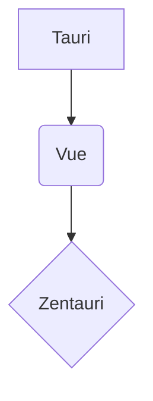

# Welcome to Zentauri

This is a minimal Markdown editor based on Tauri and Vue.
specially designed for the presentation of text in systematic grammar works

Klick the third icon from the top in the left sideline to get a (partially clickable) cheatsheet describing the implemented
Markdown extensions

## Scholarly Editing (e.g. Sanskrit Grammar)
::: important[Check it out]
Try the extensive Markdown extensions
:::

## Formulae

You can also write math formulae using KaTeX Syntax:
$e^{i\pi} + 1 = 0$
or
$
\hat{H}\psi(x, y, z) = \left[ -\frac{\hbar^2}{2m} \left( \frac{\partial^2}{\partial x^2} + \frac{\partial^2}{\partial y^2} + \frac{\partial^2}{\partial z^2} \right) + V(x, y, z) \right] \psi(x, y, z) = E\psi(x, y, z)
$

## Diagrams
Or draw **mermaid diagrams**:

```mermaid
graph TD
  A[Tauri] --> B(Vue)
  B --> C{Zentauri}
```

## Custom Stylesheet

You can customize layout details and fonts using your own stylesheet. Zentauri will automatically look for and load a `custom.css` file from your application config directory.

To edit it:
1. Find the `custom.css` file in your application config directory (e.g. `~/.config/zentauri/custom.css` on Linux/macOS or `%APPDATA%\zentauri\custom.css` on Windows).
2. Edit the file to apply your own CSS overrides. A template has been automatically created for you.
3. Restart Zentauri to see the changes.

### Example: Modifying the Grammar-Box
You can easily change the styling of built-in syntax elements like the `::: grammar-box` by overriding their CSS classes in your `custom.css`.

```css
/* Change the grammar-box to a light blue theme */
.vp-doc .custom-block.grammar-box,
.grammar-box {
  background-color: #f0f8ff !important;
  border-left-color: #0369a1 !important;
}
```

## Creating New Syntax Elements

Thanks to `markdown-it-extensible`, creating completely new syntax elements is very straightforward. There are two types:

### 1. New Inline Elements (Zero-Code)
You can invent new inline markers on the fly without changing any JavaScript code! Just write `:your-class[text]` in your Markdown file.
For example, if you write:
```markdown
This is a :magic[special text].
```
It will automatically render as `<span class="magic">special text</span>`. 
To style it, just add `.magic` to your `custom.css`:
```css
.magic {
  color: magenta;
  font-weight: bold;
}
```

### 2. New Block Containers
Because the Markdown parser needs to know block names in advance, we have pre-registered five dummy containers for you: `custom1`, `custom2`, `custom3`, `custom4`, and `custom5`. 

You can use them immediately in Markdown without recompiling:
```markdown
::: custom1 [My Custom Title]
This is my own custom box!
:::
```

To style it, just target the class in your `custom.css`:
```css
.custom-block.custom1 {
  background-color: #e0f2fe;
  border-left: 4px solid #0284c7;
  padding: 1rem;
}
```

If you need *more* than five custom containers (or if you want to rename existing containers), you will need to register them in the Zentauri source code first:
1. Open `src/lib/markdown.ts`
2. Scroll to the `extensiblePlugin` configuration and add your box to the `blockContainers` array:
   ```typescript
   { name: "my-box", className: "my-box" },
   ```
3. Recompile Zentauri.