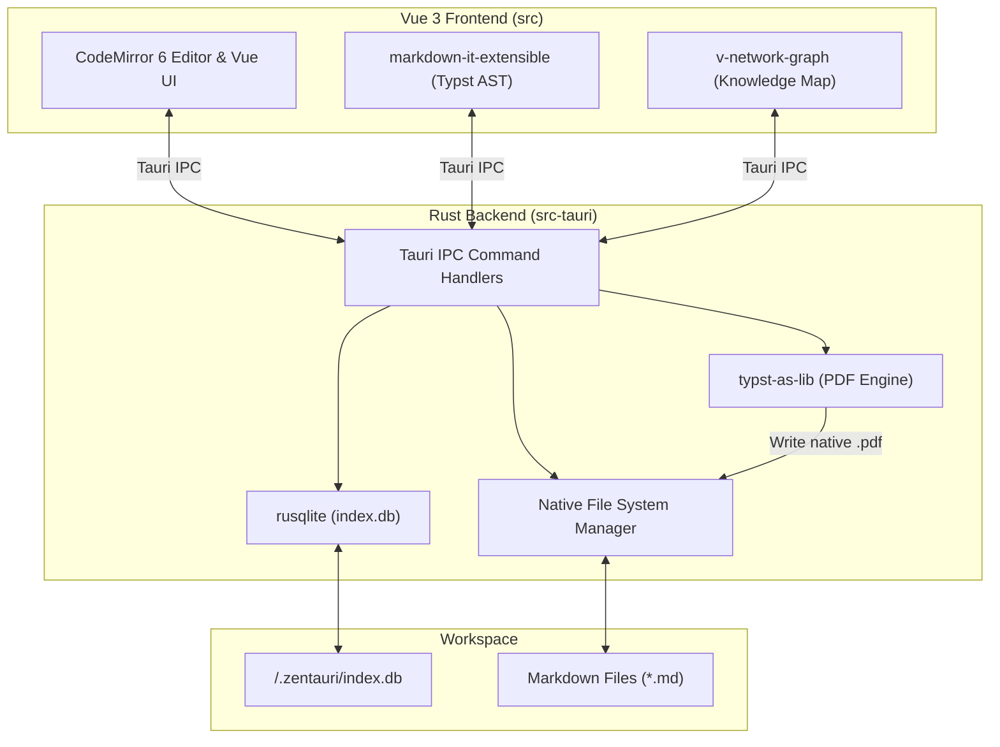

# 📐 System-Architektur

Zentauri basiert auf einem strikten **Rust-First**- und **Tauri-Native**-Ansatz. Dies garantiert maximale Performance, Speichersicherheit und Zukunftssicherheit für WebAssembly und moderne Rust-Toolchains.

---

## 1. Grundprinzipien

- **Kein schweres Node.js-Ökosystem:** Wir vermeiden schwere Node.js-Libraries (wie Playwright oder Electron) für Backend-Operationen.
- **Rust Backend (`src-tauri`):** Sämtliche Dateisystem-Operationen, Workspace-Indexierungen und Datenextraktionen erfolgen nativ in Rust.
- **Dumb UI (`src`):** Das Vue 3 Frontend fungiert als reine Präsentationsschicht und kommuniziert über schlanke Tauri IPC-Befehle mit dem Backend.

---

## 2. Komponenten-Topologie

---

## 3. Datenbank & Indexierung

Zentauri verwaltet eine lokale SQLite-Datenbank (`.zentauri/index.db`) innerhalb jedes geöffneten Workspaces:

- **`files`**: Speichert Dateipfade, Ordnerstrukturen, Zeitstempel und Dateigrößen.
- **`markdown_metadata`**: Speichert extrahiertes YAML-Frontmatter wie `title`, `tags`, `iast` und `devanagari`.
- **`markdown_links`**: Bildet `[[Wiki-Links]]` und Standard-Links als Indexbasis ab (interaktive Graph-Oberfläche geparkt auf der [Roadmap](./roadmap)).

---

## 4. Nativer Typst PDF-Export (Roadmap / Architekturplan)

Zentauris Architektur-Roadmap verzichtet vollständig auf Headless-Chromium-Engines zugunsten eines nativen Rust-Satzes. Für Version 2.0.0 ist die Einbindung von **Typst** (`typst-as-lib`) direkt im Tauri-Backend geplant (siehe [Roadmap & Backlog](./roadmap)). Das Vue-Frontend generiert aus dem Markdown einen Typst-AST, übergibt diesen per IPC an Rust, und der native Typst-Compiler erzeugt blitzschnell ein akademisch gesetztes PDF ohne externe Toolchains.

---

## 5. Sanskrit-Eingabesteuerung (Hybrid-Architektur)

Für indologische Mischtexte (Deutsch/Englisch + IAST/Devanāgarī) verfolgt Zentauri ein dreistufiges Hybrid-Konzept auf Applikationsebene statt fehleranfälliger OS-Tastaturlayouts oder reinem ASCII-Harvard-Kyoto:

1. **Kanonische Speicherung (Aktiv):** Persistenz im Markdown-Quelltext immer in standardkonformem IAST (`kṛṣṇaḥ`) oder Devanāgarī (`कृष्णः`).
2. **In-Editor IME (Roadmap / Backlog für v2.0.0):** Automatische Scope-basierte Live-Transliteration aus Harvard-Kyoto innerhalb von `《...》` und `⟪...⟫` sowie Compose-Sequenzen für den Fließtext.
3. **Post-Hoc Tooling (Aktiv):** Globale Tastaturkürzel (`⌥⌘D`, `⌥⌘H`) und Toolbar-Schalter mit tag-sicherem Parsing zur schnellen Wandlung markierter Abschnitte.

Ausführliche Spezifikation und Entscheidungsmatrix siehe: [Sanskrit-Eingabearchitektur](./scholarly-input-architecture.md) und [Roadmap & Backlog](./roadmap).
