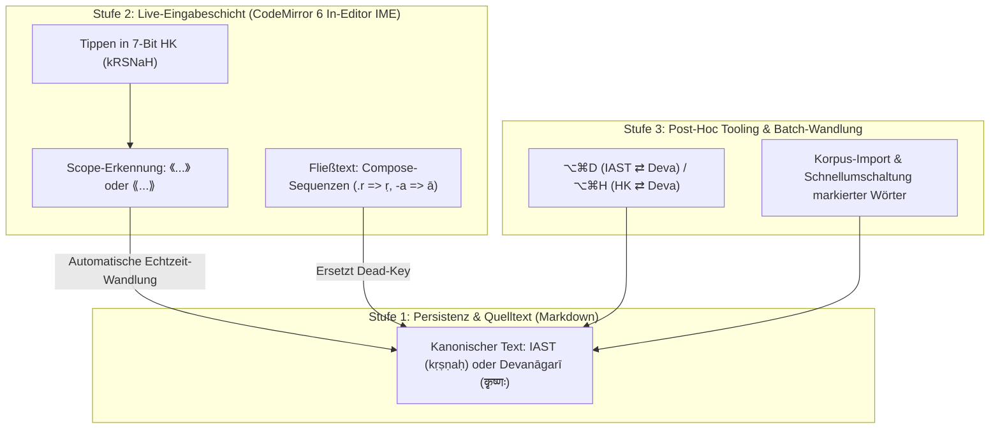

# ⌨️ Sanskrit-Eingabesteuerung & Hybrid-Architektur

Dieses Dokument erfasst die architektonische Analyse und Entscheidungsmatrix zur Handhabung von Sanskrit-Eingaben (IAST, Harvard-Kyoto, Devanāgarī) in Zentauri.

---

## 1. Ausgangslage & Problemstellung

Wissenschaftliche Texte und Lehrmaterialien im Bereich Indologie/Sanskrit sind typischerweise **Mischtexte**:
* Fließtext in modernen Sprachen (Deutsch, Englisch) mit normaler Satzstruktur und Groß-/Kleinschreibung.
* Eingebettete Sanskrit-Fachbegriffe, Flexionsformen, Zitate und Verse in IAST (International Alphabet of Sanskrit Transliteration) oder Devanāgarī.

Daraus resultiert ein ergonomischer Zielkonflikt bei der Tastatureingabe:
1. **Diakritika-Reichtum:** IAST erfordert Makrons (`ā`, `ī`, `ū`), Unterpunkte (`ṛ`, `ṝ`, `ḷ`, `ṃ`, `ḥ`, `ṭ`, `ḍ`, `ṇ`, `ṣ`), Tilden (`ñ`) und Akzente (`ś`), die auf Standard-Tastaturen keine Direkttasten besitzen.
2. **Standard-ASCII-Alternativen:** Transliterationssysteme wie **Harvard-Kyoto (HK)** kodieren alle Phoneme verlustfrei in 7-Bit ASCII (`kRSNaH`), sind jedoch für Druck und Bildschirmlesung ungeeignet.
3. **Persistenz vs. Eingabefluss:** Wie soll der Text im Markdown-Dokument gespeichert werden, und wo/wie soll die Eingabetransformation erfolgen?

---

## 2. Architektonische Entscheidungsmatrix

| Dimension | Option A: OS-Tastaturlayout | Option B: Nur Harvard-Kyoto (HK) | Option C: Applikationsebene (Editor-IME) |
| :--- | :--- | :--- | :--- |
| **Setup-Aufwand** | Hoch (Benutzer muss Drittanbieter-Layouts wie EasyUnicode installieren). | Keiner (Standard-US/DE-Tastatur genügt). | **Keiner** (funktioniert out-of-the-box in der App). |
| **Plattformkonsistenz** | Gering (macOS, Windows und Linux nutzen komplett unterschiedliche Dead-Keys). | Hoch (plattformunabhängiges ASCII). | **Absolut** (identisches Verhalten auf allen Betriebssystemen via CodeMirror 6). |
| **Schreibfluss im Mischtext** | **Störend:** Ständiger Wechsel des Systemlayouts (z. B. `Cmd+Space`) mitten im Satz. | Mäßig: Manuelle Konvertierung oder unleserlicher Quelltext. | **Nahtlos:** Kontextabhängige automatische Wandlung ohne Tastenlayout-Wechsel. |
| **Quelltext-Lesbarkeit** | Hervorragend (echtes IAST im Markdown). | **Schlecht:** ASCII-Kürzel (`dharmakSetre`) wirken typografisch unruhig. | Hervorragend (echtes IAST oder Devanāgarī im Quelltext). |
| **Satzanfang / Großschreibung** | Kein Konflikt. | **Konflikt:** Großbuchstaben in HK sind phonetisch belegt (`R` = ṛ, `S` = ṣ). | Kein Konflikt dank kontextueller Scopes. |
| **Korpus-Kompatibilität** | Hoch. | Gering (müsste vorab konvertiert werden). | **Hoch** (bestehende IAST- und Devanāgarī-Dateien bleiben unverändert). |

---

## 3. Das 3-stufige Hybridkonzept

Aus der Gegenüberstellung ergibt sich die hybride Architektur, die maximale Ergonomie bei voller Standardkonformität gewährleistet:

### Stufe 1: Kanonische Speicherung (Markdown-Ebene)
* Das Markdown-Dokument speichert **immer** echtes IAST (`kṛṣṇaḥ`) oder natives Unicode-Devanāgarī (`कृष्णः`).
* Keine Bindung an Zentauri: Die Dateien bleiben in Git, GitHub, VS Code und Typst typografisch sauber und lesbar.
* Harvard-Kyoto fungiert rein als Eingabe- und Transformationswerkzeug, niemals als Zwangs-Speicherformat.

### Stufe 2: Kontext-gesteuerte Live-Eingabe (In-Editor IME)
Die Eingabesteuerung erfolgt direkt in der CodeMirror-6-Transaktionsschicht des Editors:
1. **Scope-basierter Live-IME:**
   * Innerhalb der etablierten Sanskrit-Klammern (`《...》` und `⟪...⟫`) tippt der Autor in flüssigem Harvard-Kyoto ASCII.
   * Der Editor transformiert die Zeichen beim Tippen sofort in die konfigurierte Zieldarstellung (IAST oder Devanāgarī).
   * Außerhalb der Klammern bleibt die Tastatur auf Standard-Deutsch/Englisch.
2. **Compose-Key Simulation im freien Text:**
   * Für einzelne Sanskrit-Wörter im Fließtext ohne Klammern bietet der Editor intuitive Compose-Sequenzen (z. B. `.r` => `ṛ`, `-a` => `ā`, `~n` => `ñ`, `'s` => `ś`, `.s` => `ṣ`), ohne dass der Benutzer ein OS-Sonderlayout benötigt.

### Stufe 3: Post-Hoc Transliteration & Korpus-Tools (Bereits implementiert)
* Tastatur-Shortcuts `⌥⌘D` (IAST ⇄ Devanāgarī) und `⌥⌘H` (Harvard-Kyoto ⇄ Devanāgarī) im Header und Editor.
* Schnelle Umwandlung bestehender Texte, Zitate oder importierter Korpora.

---

## 4. Garantie für native OS-Tastaturlayouts (EasyUnicode / Dead-Keys)

**Ja, direkte Eingaben über installierte OS-Tastaturlayouts sind zu 100 % gewährleistet und bleiben vollwertig unterstützt:**

1. **Native Unicode-Durchleitung:** CodeMirror 6 verarbeitet alle vom Betriebssystem gesendeten Zeichen (`beforeinput`/`input`) transparent. Wer auf OS-Ebene z. B. `⌥a` => `ā` oder `⌥r` => `ṛ` tippt, schreibt ohne jeden Umweg direkt IAST in das Dokument.
2. **Kollisionsfreiheit:** Der anwendungsbasierte Editor-IME (Stufe 2) verarbeitet ausschließlich reine ASCII-Zeichenfolgen (Harvard-Kyoto) und lässt bereits zusammengesetzte IAST-Unicode-Zeichen (`ā`, `ī`, `ū`, `ṛ`, `ṣ` etc.) unangetastet.
3. **Abschaltbarkeit (Opt-in / Passthrough):** Stufe 2 wird als optionaler Modus konfigurierbar sein (*Editor-IME: Auto / HK-to-IAST / Aus*). Autoren mit eingespieltem OS-Tastaturlayout können den Editor-IME vollständig deaktiviert lassen und wie gewohnt arbeiten.

