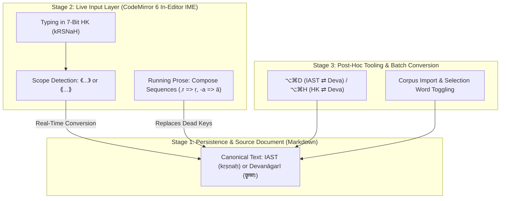

# ⌨️ Sanskrit Input Control & Hybrid Architecture

This document outlines the architectural analysis and decision matrix governing Sanskrit input workflows (IAST, Harvard-Kyoto, Devanāgarī) in Zentauri.

---

## 1. Context & Problem Statement

Scholarly texts, critical editions, and didactic materials in Indology and Sanskrit are typically **mixed-language corpora**:
* Running prose in modern languages (English, German) with standard casing, capitalization, and punctuation.
* Embedded Sanskrit technical terminology, declension paradigms, citations, and verses in IAST (International Alphabet of Sanskrit Transliteration) or Devanāgarī.

This creates a fundamental ergonomic tension during keyboard input:
1. **Abundance of Diacritics:** IAST requires macrons (`ā`, `ī`, `ū`), underdots (`ṛ`, `ṝ`, `ḷ`, `ṃ`, `ḥ`, `ṭ`, `ḍ`, `ṇ`, `ṣ`), tildes (`ñ`), and acute accents (`ś`), none of which exist as dedicated keys on standard physical keyboards.
2. **Standard ASCII Alternatives:** Transliteration schemes like **Harvard-Kyoto (HK)** map all phonemes losslessly to 7-bit ASCII (`kRSNaH`), but raw ASCII notation is unsuitable for publication, print, and screen reading.
3. **Persistence vs. Authoring Flow:** How should text be persisted in the underlying Markdown file, and where/how should phonetic transformation occur?

---

## 2. Architectural Decision Matrix

| Dimension | Option A: OS Keyboard Layout | Option B: Harvard-Kyoto Only | Option C: Application-Level (Editor IME) |
| :--- | :--- | :--- | :--- |
| **Setup Overhead** | High (User must install third-party layouts like EasyUnicode). | None (Standard US/UK keyboard suffices). | **None** (Works immediately out-of-the-box in the application). |
| **Cross-Platform Consistency** | Low (macOS, Windows, and Linux use vastly different dead-key chains). | High (Platform-independent ASCII). | **Absolute** (Identical behavior across all platforms via CodeMirror 6). |
| **Flow in Mixed Text** | **Disruptive:** Constant switching of OS input sources (e.g. `Cmd+Space`) mid-sentence. | Moderate: Manual post-conversion or unreadable source text. | **Seamless:** Context-aware automatic conversion without switching keyboard layouts. |
| **Source Readability** | Excellent (True IAST directly in Markdown). | **Poor:** ASCII mnemonics (`dharmakSetre`) disrupt visual reading flow. | Excellent (True IAST or Devanāgarī preserved in source). |
| **Sentence Capitalization** | No conflict. | **Conflict:** Uppercase letters in HK carry phonetic meaning (`R` = ṛ, `S` = ṣ). | No conflict thanks to contextual scope boundaries. |
| **Corpus Compatibility** | High. | Low (Requires pre-filtering before export). | **High** (Existing IAST and Devanāgarī documents remain untouched). |

---

## 3. The 3-Stage Hybrid Concept

Synthesizing these trade-offs yields a hybrid architecture that balances maximum authoring ergonomics with strict standard compliance:

### Stage 1: Canonical Storage (Markdown Level)
* The underlying Markdown file **always** persists standard IAST (`kṛṣṇaḥ`) or native Unicode Devanāgarī (`कृष्णः`).
* No vendor lock-in: Files remain clean, interoperable, and readable in Git, GitHub, VS Code, and Typst.
* Harvard-Kyoto functions purely as an authoring accelerator and transliteration tool, never as an enforced storage format.

### Stage 2: Context-Aware Live Input (In-Editor IME)
Input handling is embedded directly within CodeMirror 6's transaction layer:
1. **Scope-Based Live IME:**
   * Inside designated Sanskrit delimiters (`《...》` and `⟪...⟫`), the author types in fluent Harvard-Kyoto ASCII.
   * The editor converts characters on the fly into the configured target representation (IAST or Devanāgarī).
   * Outside delimiters, the keyboard remains in standard language mode without interference.
2. **Compose-Key Sequences in Running Prose:**
   * For individual words without bracket delimiters, the editor emulates intuitive compose sequences (e.g., `.r` => `ṛ`, `-a` => `ā`, `~n` => `ñ`, `'s` => `ś`, `.s` => `ṣ`) without requiring custom OS keyboards.

### Stage 3: Post-Hoc Transliteration & Corpus Tools (Active)
* Global keyboard shortcuts `⌥⌘D` (IAST ⇄ Devanāgarī) and `⌥⌘H` (Harvard-Kyoto ⇄ Devanāgarī) available in the editor and toolbar.
* Fast, lossless conversion of selected words or whole documents during corpus ingestion.

---

## 4. Guarantee for Native OS Keyboard Layouts (EasyUnicode / Dead Keys)

**Direct input via installed operating-system keyboard layouts remains 100% supported and uninhibited:**

1. **Transparent Unicode Passthrough:** CodeMirror 6 processes all character input events sent by the OS (`beforeinput`/`input`) transparently. Authors who type e.g. `⌥a` => `ā` or `⌥r` => `ṛ` directly insert standard IAST into the document.
2. **Zero Collision Risk:** The application-level Editor IME (Stage 2) listens solely to ASCII token patterns (Harvard-Kyoto) and leaves pre-composed Unicode glyphs (`ā`, `ī`, `ū`, `ṛ`, `ṣ` etc.) completely untouched.
3. **Configurable Passthrough (Opt-in / Opt-out):** Stage 2 will provide configurable toggle states (*Editor IME: Auto / HK-to-IAST / Off*). Authors accustomed to established OS layouts can keep the in-editor IME disabled and work exactly as before.
