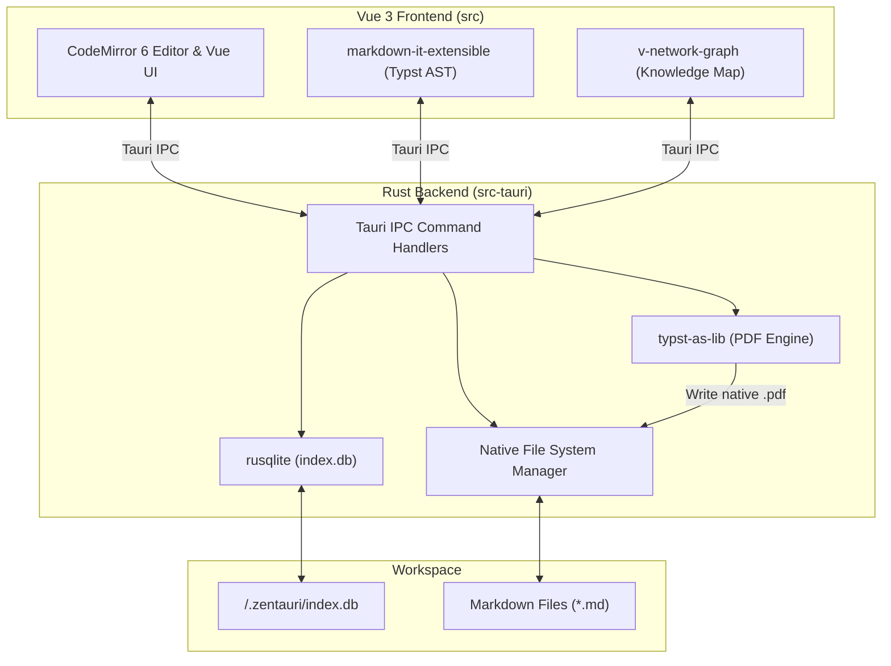

# 📐 System Architecture

Zentauri adopts a strict **Rust-First** and **Tauri-Native** approach. This guarantees maximum performance, memory safety, and future-proof compatibility with WebAssembly and advanced Rust toolchains.

---

## 1. Core Principles

- **No Heavy Node.js Ecosystem:** We avoid heavy Node.js libraries (like Playwright or Electron) for backend operations.
- **Rust Backend (`src-tauri`):** All file-system operations, workspace indexing, and data extractions happen natively in Rust.
- **Dumb UI (`src`):** The Vue 3 frontend acts strictly as a presentation layer and relies on Tauri IPC commands for data access.

---

## 2. Component Topology

---

## 3. Database & Indexing

Zentauri maintains a local SQLite database (`.zentauri/index.db`) within each open workspace. This allows for lightning-fast queries and powers advanced features:

- **`files`**: Tracks file paths, directory structures, timestamps, and sizes.
- **`markdown_metadata`**: Stores parsed YAML frontmatter like `title`, `tags`, `iast`, and `devanagari` values for scholarly lookup.
- **`markdown_links`**: Maps `[[wiki-links]]` and standard markdown links, which enables the Interactive Knowledge Graph.

::: tip WICHTIG
The indexing process leverages Rust's `regex` and `serde_yaml` crates for high-speed parsing.
:::

---

## 4. Native PDF Export

Zentauri completely drops heavy Chromium/Playwright dependencies in favor of native Rust rendering. We use **Typst** (`typst-as-lib`) directly inside the Tauri backend. The Vue frontend generates a Typst AST string from the Markdown document, passes it via IPC to Rust, and Rust compiles a beautiful, academic PDF in milliseconds.
