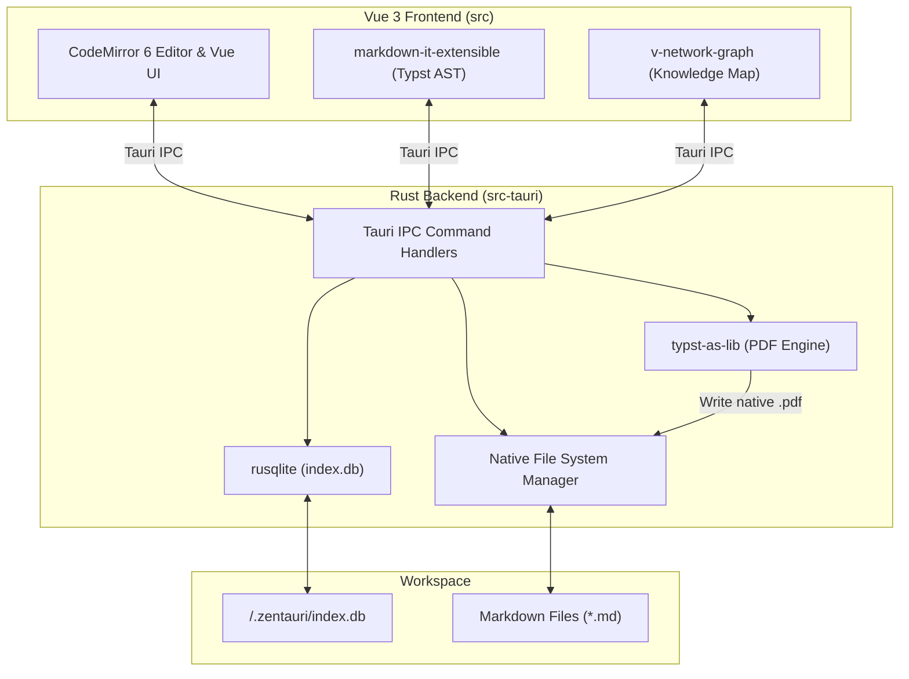

# 📐 System Architecture

Zentauri adopts a strict **Rust-First** and **Tauri-Native** approach. This guarantees maximum performance, memory safety, and future-proof compatibility with WebAssembly and advanced Rust toolchains.

---

## 1. Core Principles

- **No Heavy Node.js Ecosystem:** We avoid heavy Node.js libraries (like Playwright or Electron) for backend operations.
- **Rust Backend (`src-tauri`):** All file-system operations, workspace indexing, and data extractions happen natively in Rust.
- **Dumb UI (`src`):** The Vue 3 frontend acts strictly as a presentation layer and relies on Tauri IPC commands for data access.

---

## 2. Component Topology

---

## 3. Database & Indexing

Zentauri maintains a local SQLite database (`.zentauri/index.db`) within each open workspace. This allows for lightning-fast queries and powers advanced features:

- **`files`**: Tracks file paths, directory structures, timestamps, and sizes.
- **`markdown_metadata`**: Stores parsed YAML frontmatter like `title`, `tags`, `iast`, and `devanagari` values for scholarly lookup.
- **`markdown_links`**: Maps `[[wiki-links]]` and standard markdown links, preparing relational graph indexing (interactive UI parked on [Roadmap](./roadmap)).

::: tip WICHTIG
The indexing process leverages Rust's `regex` and `serde_yaml` crates for high-speed parsing.
:::

---

## 4. Native PDF Export (Roadmap / Architecture Plan)

Zentauri's architectural roadmap drops heavy Chromium/Playwright dependencies in favor of native Rust rendering. We have planned the integration of **Typst** (`typst-as-lib`) directly inside the Tauri backend for v2.0.0 (see [Roadmap & Backlog](./roadmap)). The Vue frontend will generate a Typst AST string from the Markdown document, passing it via IPC to Rust, which compiles an academic PDF in milliseconds without external toolchains.

---

## 5. Sanskrit Input Architecture (Hybrid Framework)

For multilingual scholarly prose (English/German + IAST/Devanāgarī), Zentauri adopts a 3-stage hybrid input architecture at the application level rather than relying on brittle OS layouts or raw ASCII Harvard-Kyoto:

1. **Canonical Persistence (Active):** Source Markdown files always store standard IAST (`kṛṣṇaḥ`) or Devanāgarī (`कृष्णः`).
2. **In-Editor IME (Roadmap / Backlog for v2.0.0):** Automatic scope-based live transliteration from Harvard-Kyoto inside `《...》` and `⟪...⟫`, accompanied by compose-key sequences for running prose.
3. **Post-Hoc Tooling (Active):** Global shortcuts (`⌥⌘D`, `⌥⌘H`) and toolbar toggles with tag-safe parsing for instantaneous selection toggling.

Full architectural specification and trade-off matrix: [Sanskrit Input Architecture](./scholarly-input-architecture.md) and [Roadmap & Backlog](./roadmap).
